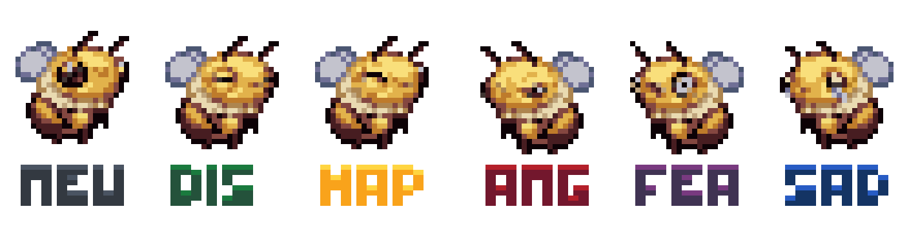
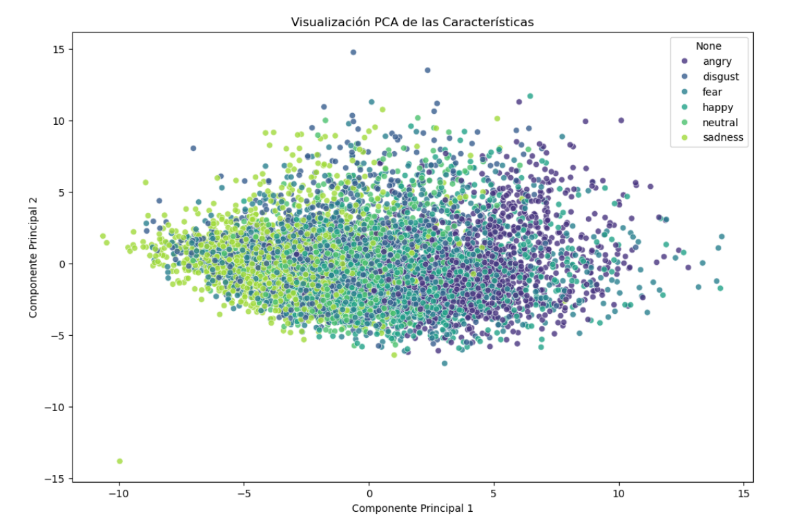
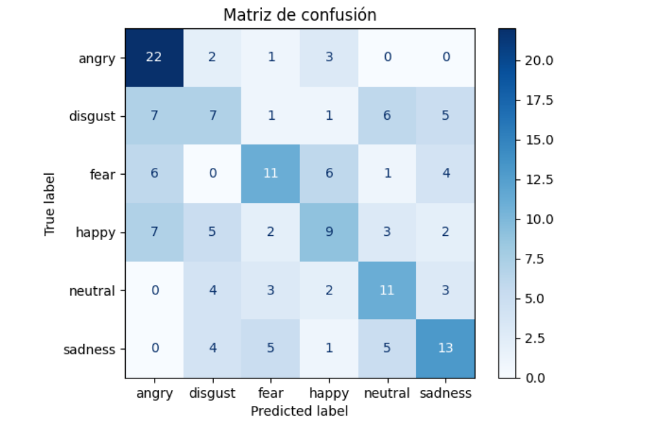

# AI-Emotion-Classifier

AI-powered Speech Emotion Recognition project developed in Python using Machine Learning techniques to classify human emotions from voice recordings.

This project explores how acoustic features extracted from speech signals can be used to detect emotional states such as happiness, sadness, anger, fear, disgust, and neutrality.

---

<p align="center">
  
</p>

<p align="center">
  <em>Emotion prediction demo from voice input</em>
</p>

---

## Project Overview

Human speech contains patterns that reveal emotional information through tone, intensity, frequency, and rhythm.

The goal of this project is to study the viability of emotion classification from audio using classical Machine Learning workflows and speech feature extraction techniques.

The project covers:

- Audio preprocessing
- Acoustic feature extraction
- MFCC analysis
- Model training
- Performance evaluation
- Emotion prediction

Developed as a university Machine Learning assignment.

---

## Dataset

This project uses a subset of the  
:contentReference[oaicite:0]{index=0} dataset.

CREMA-D contains over 7,000 emotional speech recordings from 91 actors expressing different emotions with varying intensity levels. :contentReference[oaicite:1]{index=1}

Supported emotions include:

- Angry
- Disgust
- Fear
- Happy
- Neutral
- Sad

Dataset resources:

- [CREMA-D Official Repository](https://github.com/CheyneyComputerScience/CREMA-D?utm_source=chatgpt.com)
- [TensorFlow Dataset Documentation](https://www.tensorflow.org/datasets/catalog/crema_d?utm_source=chatgpt.com)

---

## Machine Learning Pipeline

```text
Audio Input
    ↓
Audio Preprocessing
    ↓
Feature Extraction (MFCCs)
    ↓
Feature Scaling
    ↓
Model Training
    ↓
Emotion Prediction
    ↓
Evaluation & Visualization
```

---

## Technologies Used

- Python
- :contentReference[oaicite:4]{index=4}
- :contentReference[oaicite:5]{index=5}
- :contentReference[oaicite:6]{index=6}
- NumPy
- Pandas
- Matplotlib

---

## Notebook

Main notebook:

👉 [Open Main Notebook](./Clasificador_Emociones.ipynb)

The notebook includes:

- Data loading and preprocessing
- Audio visualization
- Feature extraction with MFCCs
- Machine Learning model training
- Evaluation metrics
- Emotion prediction examples
- Conclusions and analysis

---

## Visualizations

### Dataset features

<p align="center">
  
</p>

---

### Confusion Matrix

<p align="center">
  
</p>

---

## Results

The model was trained and evaluated using labeled emotional speech samples.

Evaluation metrics include:

- Accuracy
- Classification Report
- Confusion Matrix
- Emotion prediction examples

The project focuses not only on prediction accuracy, but also on understanding the complete audio Machine Learning workflow and the challenges of speech emotion recognition.

---

## Installation

Clone the repository:

```bash
git clone https://github.com/MarcMasters/AI-Emotion-Classifier.git
cd AI-Emotion-Classifier
```

Install dependencies:

```bash
pip install -r requirements.txt
```

Launch Jupyter Notebook:

```bash
jupyter notebook
```

---

## License

This project is intended for educational, research, and portfolio purposes.

Please review the dataset license before commercial usage. :contentReference[oaicite:7]{index=7}

---

## Author

Developed by Marcos, Pablo, Dazhan and Daniel

- GitHub: [https://github.com/MarcMasters](https://github.com/MarcMasters)
- LinkedIn: [https://www.linkedin.com/in/marcos-olmo](https://www.linkedin.com/in/marcos-olmo-l%C3%B3pez-948592347/?locale=es)
